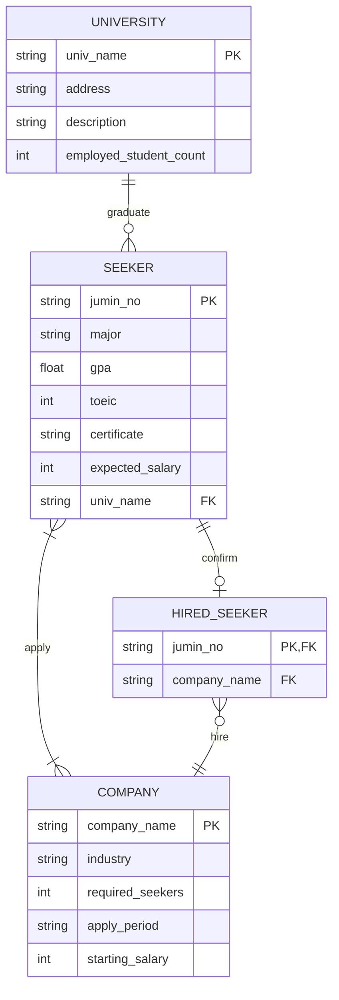
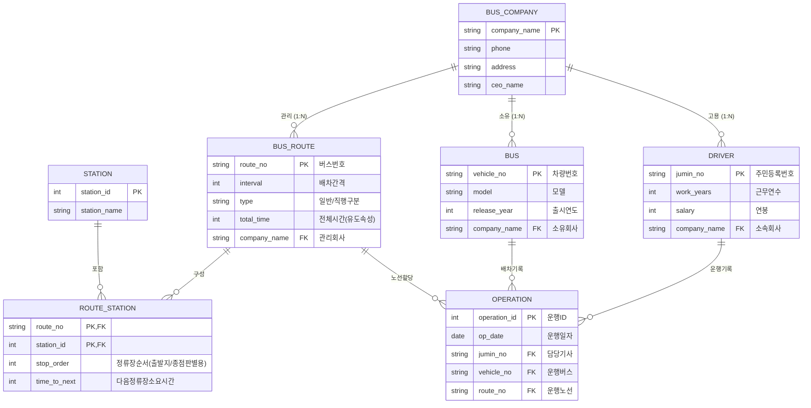

## 문제 1의 DB

```mermaid
erDiagram
    UNIVERSITY ||--o{ SEEKER : graduate
    SEEKER }|--|{ COMPANY : apply
    SEEKER ||--o| HIRED_SEEKER : confirm
    HIRED_SEEKER }o--|| COMPANY : hire

    SEEKER {
        string jumin_no PK
        string major
        float gpa
        int toeic
        string certificate
        int expected_salary
        string univ_name FK
    }

    COMPANY {
        string company_name PK
        string industry
        int required_seekers
        string apply_period
        int starting_salary
    }

    UNIVERSITY {
        string univ_name PK
        string address
        string description
        int employed_student_count
    }

    HIRED_SEEKER {
        string jumin_no PK, FK
        string company_name FK
    }
```

## 문제 2의 DB

```mermaid
erDiagram
    BUS_COMPANY ||--o{ BUS_ROUTE : "관리 (1:N)"
    BUS_COMPANY ||--o{ BUS : "소유 (1:N)"
    BUS_COMPANY ||--o{ DRIVER : "고용 (1:N)"

    BUS_ROUTE ||--o{ ROUTE_STATION : "구성"
    STATION ||--o{ ROUTE_STATION : "포함"

    DRIVER ||--o{ OPERATION : "운행기록"
    BUS ||--o{ OPERATION : "배차기록"
    BUS_ROUTE ||--o{ OPERATION : "노선할당"

 
    BUS_ROUTE {
        string route_no PK "버스번호"
        int interval "배차간격"
        string type "일반/직행구분"
        int total_time "전체시간(유도속성)"
        string company_name FK "관리회사"
    }


    STATION {
        int station_id PK
        string station_name
    }

    ROUTE_STATION {
        string route_no PK, FK
        int station_id PK, FK
        int stop_order "정류장순서(출발지/종점판별용)"
        int time_to_next "다음정류장소요시간"
    }

    BUS_COMPANY {
        string company_name PK
        string phone
        string address
        string ceo_name
    }

    BUS {
        string vehicle_no PK "차량번호"
        string model "모델"
        int release_year "출시연도"
        string company_name FK "소유회사"
    }

    DRIVER {
        string jumin_no PK "주민등록번호"
        int work_years "근무연수"
        int salary "연봉"
        string company_name FK "소속회사"
    }

    OPERATION {
        int operation_id PK "운행ID"
        date op_date "운행일자"
        string jumin_no FK "담당기사"
        string vehicle_no FK "운행버스"
        string route_no FK "운행노선"
    }
```

